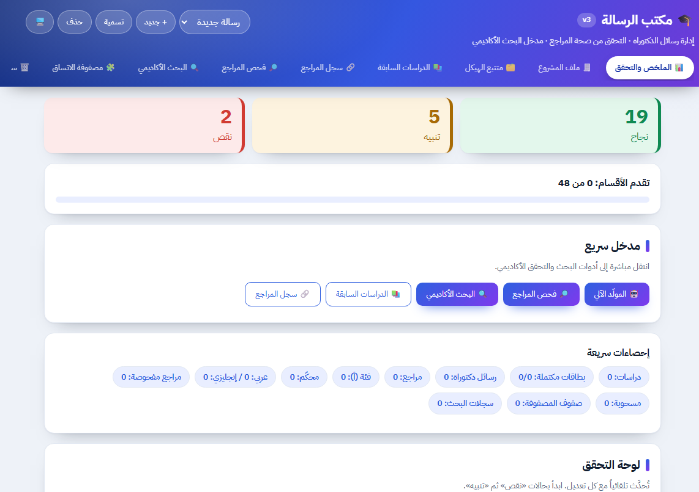
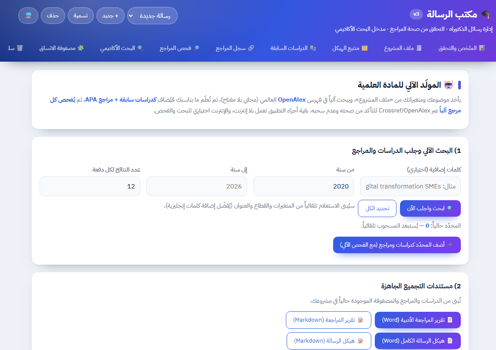
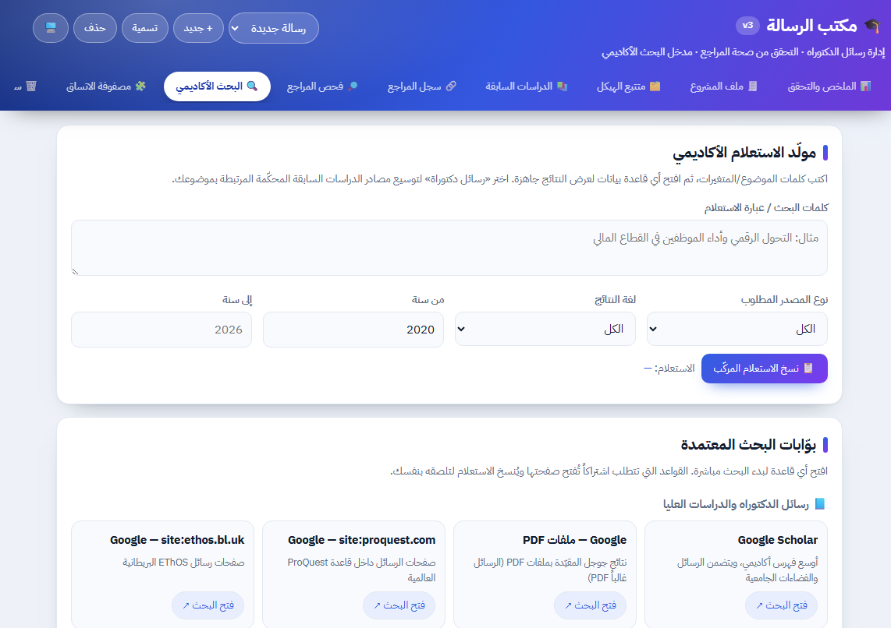
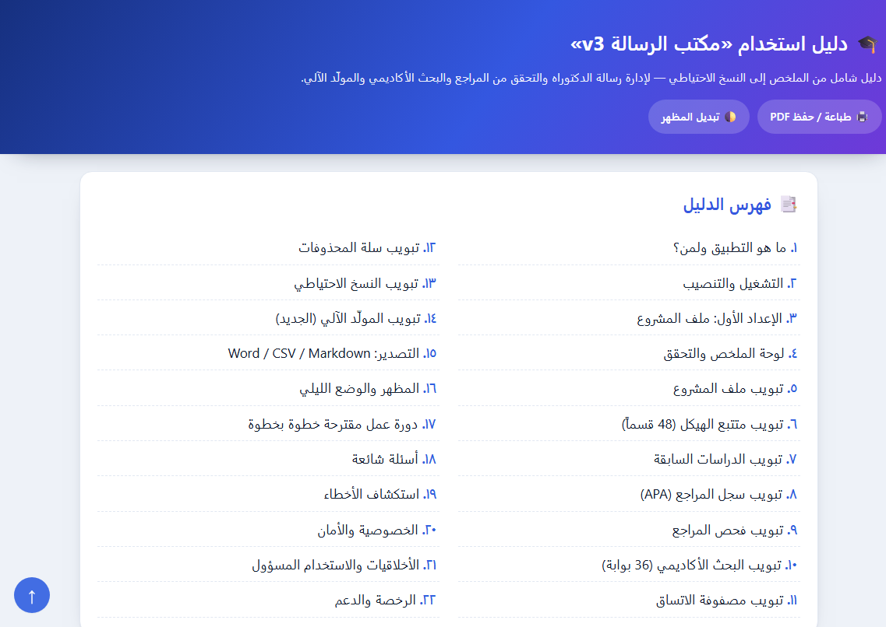
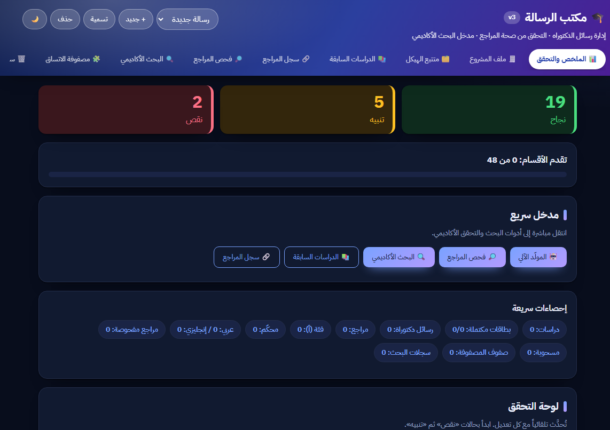

<p align="center">
  
</p>

<h1 align="center">🎓 Thesis Desk (v3)</h1>

<p align="center">
  <b>A smart assistant for managing a doctoral dissertation</b> — from defining the project to building the questionnaire, with reference verification and academic search.
</p>

<p align="center">
  <a href="https://ahmedawe2026-svg.github.io/DBA-Research-Dissertation-Assistant/"><b>🌐 Live Demo</b></a>
  &nbsp;·&nbsp;
  <a href="docs/guide.html">📖 User Guide (Arabic)</a>
  &nbsp;·&nbsp;
  <a href="README.md">العربية</a>
</p>

<p align="center">
  
  
  
  
  
</p>

---

An Arabic, RTL web app to manage a doctoral dissertation end to end: **project profile, structure tracker, literature review, reference log, reference verification, academic search, consistency matrix, and an automated generator for scholarly material**.

It works offline for most parts (data is stored locally in your browser) and uses the internet optionally for academic search and reference verification.

---

## 🖼️ Screenshots

<p align="center">
  
  
</p>
<p align="center">
  
  
</p>
<p align="center">
  
</p>

---

## ✨ Key Features

### Tabs
| # | Tab | Purpose |
|---|-----|---------|
| 0 | 📊 Summary & Validation | Progress dashboard + validation rules (25+) & statistics |
| 1 | 🧾 Project Profile | Title, sector, independent/dependent/mediator variables, minimum year (2020) |
| 2 | 🗂️ Structure Tracker | 7 parts and 48 sections with status & supervisor notes |
| 3 | 📚 Literature Review | Study cards (13 fields), categorized by axis |
| 4 | 🔗 Reference Log | APA 7 citation + category (A/B/C) + peer-reviewed/language |
| 5 | 🔎 Reference Check | Direct verification via Crossref and OpenAlex |
| 6 | 🔍 Academic Search | 36 search portals in 4 groups + query builder |
| 7 | 🧩 Consistency Matrix | Links gap/question/objective/hypothesis/tool/result/recommendation |
| 8 | 🗑️ Trash | Restore deleted items |
| 9 | 💾 Backup | Export/import projects + up to 5 snapshots |
| 10 | 🤖 Auto Generator | Automated search + verification + assembly + text generation |

### 🤖 Auto Generator (new in v3)
- **Automated search** in the global **OpenAlex** index based on project variables + extra keywords.
- Automatically excludes **retracted** works and those without a DOI.
- **Automatic insertion**: a literature item + an auto-formatted APA reference.
- **Automatic verification** of every added reference via Crossref/OpenAlex.
- **Ready-to-export documents (Word / Markdown)**:
  - Literature review report.
  - Full dissertation skeleton (with studies, matrix, and references).
- **Academic text generator** (optional) via an OpenAI-compatible API key: chapter intro, critical commentary/gap, draft questionnaire items.

---

## 🗂️ Repository Structure

```
DBA-Research-Dissertation-Assistant/
├── index.html                  # Main page
├── assets/
│   ├── css/style.css           # All styles (auto day/night)
│   ├── js/app.js               # All app logic
│   └── img/logo.svg            # Logo & icon
├── standalone/
│   └── thesis-desk-v3.html     # Self-contained single file (runs anywhere)
├── docs/
│   └── guide.html              # Full user guide (Arabic, 22 sections, printable PDF)
├── screenshots/                # Screenshots
├── README.md                   # Arabic documentation
├── README.en.md                # English documentation
├── LICENSE
└── .gitignore
```

> **Note:** There are two builds:
> - `index.html` + `assets/` → for development and GitHub Pages.
> - `standalone/thesis-desk-v3.html` → a single file, ready to open directly in a browser.

---

## 🚀 Running

### Option 1 — Open directly
Open `standalone/thesis-desk-v3.html` in your browser (Chrome / Edge / Firefox).

### Option 2 — Developer build
Open `index.html` directly, or start a local server:

```bash
python -m http.server 8080
# or
npx serve .
```
Then open `http://localhost:8080`.

### GitHub Pages
Live at: **https://ahmedawe2026-svg.github.io/DBA-Research-Dissertation-Assistant/**

---

## 🔐 Privacy & Data
- All data is stored **only in your browser** (`localStorage` key `thesis-desk-v2`); nothing is sent to any server.
- Search and verification call free public APIs:
  - [OpenAlex](https://api.openalex.org) — index search.
  - [Crossref](https://api.crossref.org) — DOI verification and metadata.
- The optional API key (for text generation) is stored locally only (`td-api`).

---

## ⚠️ Ethical Note
This app is an **assistant tool** for collecting, verifying, and formatting — not a replacement for the researcher or supervisor. Every output must be reviewed, edited, and verified, and you must comply with your institution's policy. AI-generated text is only a first draft.

---

## 🛠️ Tech Stack
- HTML5 + CSS3 + vanilla JavaScript (no external libraries).
- RTL Arabic design with automatic day/night mode.
- Runs as a local file or hosted on any static host.

---

## 🤝 Contributing

Contributions from everyone are welcome! 🎉 If you're a developer who wants to improve the project:

- Read the [Contributing Guide](CONTRIBUTING.md) and [Code of Conduct](CODE_OF_CONDUCT.md).
- Look for issues labelled **`good first issue`** or **`help wanted`**.
- Open an [Issue](../../issues) to report a bug or request a feature, or send a [Pull Request](../../pulls).
- Use [Discussions](../../discussions) for questions and ideas.

> 💡 The project is **self-contained with zero external libraries** (vanilla JS), which makes it very easy to understand and contribute to.

## ⭐ Support the project

If you like this app, please give it a **star** — it helps other developers discover it and contribute.

- 🌐 Live demo: **https://ahmedawe2026-svg.github.io/DBA-Research-Dissertation-Assistant/**
- 🐞 Report a bug or request a feature via [Issues](../../issues)

---

## 📄 License
Released under the **MIT** License — see [LICENSE](LICENSE).